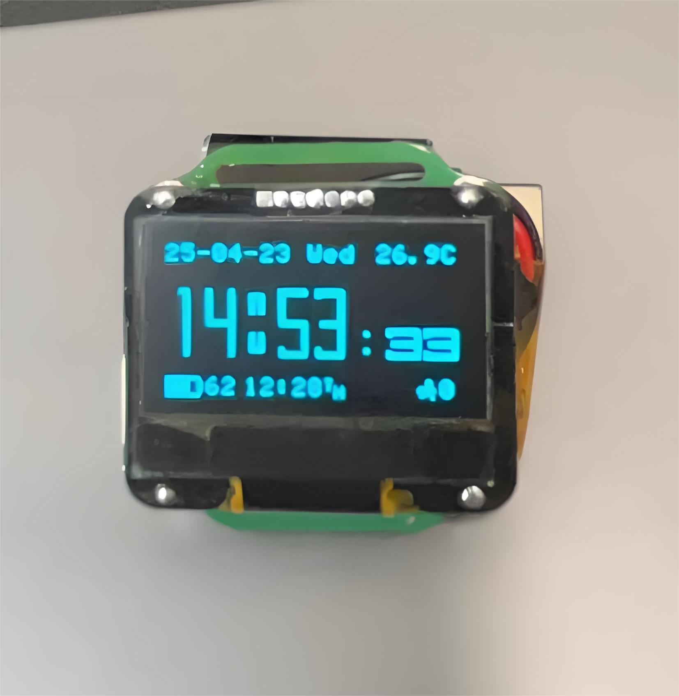

# XYWatch
基于esp32的智能手表

## 特点
* 尺寸小, 仅30mm * 30mm
* 功耗低, 充一次电可用一周
* 时钟/闹钟/游戏
* 天气
* 记步
* 抬腕/双击亮屏
* 音乐
* 蓝牙OTA

## 硬件PCB

[xywatch/XYWatch-hardware](https://github.com/xywatch/XYWatch-hardware)

## 如何开发
使用platformio进行开发

## 参考
* https://github.com/ZakKemble/NWatch
* https://github.com/sqfmi/watchy

大部分代码参考 NWatch, 小部分代码参考 watchy